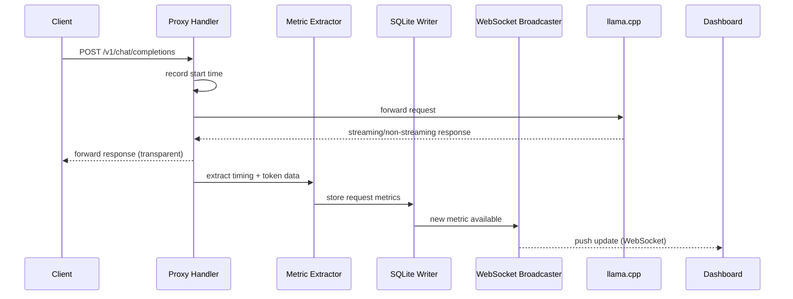

# Design: LLM Performance Monitor

## Overview

A Dockerized reverse proxy and monitoring dashboard for a locally hosted llama.cpp server. It sits between LLM clients and the llama.cpp server, intercepting all requests to collect per-request metrics (token speed, latency, usage) and system metrics (GPU, CPU, VRAM). An interactive web dashboard provides real-time and historical views of all collected data.

### Architecture at a Glance

```
┌──────────────┐     ┌──────────────────┐     ┌─────────────────┐
│  LLM Client  │────▶│  LLM Monitor     │────▶│  llama.cpp      │
│  (your apps) │◀────│  :8080           │◀────│  :8000          │
└──────────────┘     └────────┬─────────┘     └─────────────────┘
                              │
                              ├─▶ SQLite (metrics DB)
                              ├─▶ GPU polling (pynvml)
                              ├─▶ CPU polling (psutil)
                              └─▶ WebSocket ──▶ Web Dashboard
                                                       :8080/dashboard
```

## Detailed Requirements

### Functional Requirements

1. **Reverse Proxy**: Transparently forward all `/v1/*` requests to llama.cpp at `localhost:8000`
2. **Request Metrics**: Extract and store per-request timing and token data from llama.cpp responses
3. **System Metrics**: Poll GPU (via pynvml) and CPU/memory (via psutil) at configurable intervals
4. **Web Dashboard**: Interactive web UI with real-time charts, historical views, and filtering
5. **REST API**: JSON API for programmatic access to metrics data
6. **WebSocket**: Real-time data push to connected dashboard clients
7. **Data Retention**: Automatic cleanup of metrics older than configurable retention period (default: 30 days)

### Non-Functional Requirements

1. **Low overhead**: Proxy adds <5ms latency per request
2. **Resilient**: Metric storage failures never block client requests
3. **Docker-native**: Single container, configurable via environment variables
4. **Local-only**: No authentication, trusted network assumption
5. **Persistent storage**: SQLite database on Docker volume for data survival across restarts

## Architecture

### Component Diagram

```
                    ┌─────────────────────────────────────────────────┐
                    │              LLM Monitor Container               │
                    │                                                  │
  ┌───────────┐     │  ┌─────────────┐    ┌──────────────────────┐   │
  │  Client   │────▶│  │  Proxy      │    │    Background        │   │
  │           │◀────│  │  Handler    │    │    Tasks             │   │
  └───────────┘     │  │  (FastAPI)  │    │                      │   │
                    │  │             │    │  ┌────────────────┐  │   │
                    │  │  /v1/*      │    │  │ GPU Poller     │  │   │
                    │  │  /dashboard │    │  │ (pynvml)       │  │   │
                    │  │  /api/*     │    │  └───────┬────────┘  │   │
                    │  │  /ws        │    │          │           │   │
                    │  └──────┬──────┘    │  ┌───────▼────────┐  │   │
                    │         │           │  │ System Poller  │  │   │
                    │         ▼           │  │ (psutil)       │  │   │
                    │  ┌─────────────┐    │  └───────┬────────┘  │   │
                    │  │ Metric      │    │          │           │   │
                    │  │ Extractor   │    │  ┌───────▼────────┐  │   │
                    │  └──────┬──────┘    │  │ Retention      │  │   │
                    │         │           │  │ Cleaner        │  │   │
                    │         ▼           │  └────────────────┘  │   │
                    │  ┌─────────────┐    └──────────────────────┘   │
                    │  │ SQLite      │                                │
                    │  │ Writer      │                                │
                    │  └──────┬──────┘                                │
                    │         │                                        │
                    │         ▼                                        │
                    │  ┌─────────────┐    ┌──────────────────────┐   │
                    │  │ WebSocket   │    │  Static File         │   │
                    │  │ Broadcaster │    │  Server              │   │
                    │  └─────────────┘    │  (dashboard UI)      │   │
                    │                     └──────────────────────┘   │
                    │                                                  │
                    └─────────────────────────────────────────────────┘
                              │              │
                              ▼              ▼
                         ┌────────┐    ┌────────────┐
                         │ SQLite │    │ NVIDIA GPU │
                         │  DB    │    │  (host)    │
                         │ (vol)  │    └────────────┘
                         └────────┘
```

### Data Flow



## Components and Interfaces

### 1. Proxy Handler (FastAPI)

- Catch-all route for `/v1/*` endpoints
- Uses `httpx.AsyncClient` to forward requests to llama.cpp
- Handles both streaming (SSE) and non-streaming responses
- Measures end-to-end latency independently of llama.cpp's reported timings

**Key routes:**
- `POST /v1/*` — Proxied to llama.cpp
- `GET /health` — Monitor + llama.cpp health status
- `GET /dashboard` — Serve web UI
- `GET /api/metrics/requests` — Request metrics with date filtering
- `GET /api/metrics/system` — System metrics with date filtering
- `GET /api/metrics/summary` — Aggregate statistics
- `GET /api/metrics/models` — Model info from llama.cpp
- `WS /ws` — WebSocket for real-time updates

### 2. Metric Extractor

Parses llama.cpp responses for:

**Non-streaming responses:**
```json
{
  "usage": {
    "prompt_tokens": 42,
    "completion_tokens": 128,
    "total_tokens": 170
  },
  "timings": {
    "prompt_n": 42,
    "prompt_ms": 850.5,
    "predicted_n": 128,
    "predicted_ms": 2400.3
  }
}
```

**Streaming responses:**
- Parse each SSE chunk
- Final chunk contains `usage` and `timings` fields
- Measure wall-clock time for first-token latency (TTFT)

**Derived metrics:**
- `prompt_tokens_per_second` = `prompt_n` / (`prompt_ms` / 1000)
- `generation_tokens_per_second` = `predicted_n` / (`predicted_ms` / 1000)
- `total_latency_ms` = wall-clock measurement
- `time_to_first_token_ms` = time from request to first SSE chunk

### 3. System Pollers

**GPU Poller (pynvml):**
- Interval: 5 seconds
- Metrics: GPU utilization %, memory used/total MB, temperature °C, power W
- Graceful degradation: if no NVIDIA GPU detected, skip silently

**System Poller (psutil):**
- Interval: 10 seconds
- Metrics: CPU usage %, memory used/total MB, swap used/total MB

**Retention Cleaner:**
- Runs hourly
- Deletes records older than `RETENTION_DAYS` (default: 30)
- VACUUMs database monthly

### 4. WebSocket Broadcaster

- Maintains set of connected dashboard clients
- Pushes new request metrics in real-time
- Pushes system metric snapshots every 10 seconds
- Handles reconnection gracefully

## Data Models

### SQLite Schema

```sql
-- Request-level metrics
CREATE TABLE requests (
    id INTEGER PRIMARY KEY AUTOINCREMENT,
    timestamp DATETIME DEFAULT CURRENT_TIMESTAMP,
    endpoint TEXT NOT NULL,           -- e.g., /v1/chat/completions
    model TEXT,                       -- model name from request
    status_code INTEGER,              -- HTTP status from llama.cpp
    error TEXT,                       -- error message if failed

    -- Token counts
    prompt_tokens INTEGER DEFAULT 0,
    completion_tokens INTEGER DEFAULT 0,
    total_tokens INTEGER DEFAULT 0,

    -- Timing (from llama.cpp response)
    prompt_ms REAL,                   -- prompt processing time
    predicted_ms REAL,                -- generation time
    prompt_tokens_per_second REAL,
    generation_tokens_per_second REAL,

    -- Timing (measured by proxy)
    total_latency_ms REAL,            -- end-to-end wall clock
    time_to_first_token_ms REAL,      -- TTFT (streaming only)

    -- Request context
    request_body_size INTEGER,        -- bytes
    response_body_size INTEGER        -- bytes
);

CREATE INDEX idx_requests_timestamp ON requests(timestamp);
CREATE INDEX idx_requests_model ON requests(model);

-- System-level metrics (GPU + CPU)
CREATE TABLE system_metrics (
    id INTEGER PRIMARY KEY AUTOINCREMENT,
    timestamp DATETIME DEFAULT CURRENT_TIMESTAMP,

    -- GPU
    gpu_utilization REAL,             -- percentage
    gpu_memory_used_mb REAL,
    gpu_memory_total_mb REAL,
    gpu_temperature REAL,             -- Celsius
    gpu_power_watts REAL,

    -- CPU
    cpu_usage REAL,                   -- percentage
    memory_used_mb REAL,
    memory_total_mb REAL,
    swap_used_mb REAL,
    swap_total_mb REAL
);

CREATE INDEX idx_system_timestamp ON system_metrics(timestamp);

-- Running totals / state
CREATE TABLE state (
    key TEXT PRIMARY KEY,
    value TEXT,
    updated_at DATETIME DEFAULT CURRENT_TIMESTAMP
);
```

### WebSocket Message Format

```json
{
  "type": "request_metric",
  "data": {
    "timestamp": "2024-01-15T10:30:00Z",
    "model": "llama-3.1-8b",
    "prompt_tokens": 42,
    "completion_tokens": 128,
    "prompt_tps": 247.0,
    "generation_tps": 53.3,
    "total_latency_ms": 3250,
    "ttft_ms": 890
  }
}
```

```json
{
  "type": "system_metric",
  "data": {
    "timestamp": "2024-01-15T10:30:00Z",
    "gpu_utilization": 87.5,
    "gpu_memory_used_mb": 6144,
    "gpu_memory_total_mb": 8192,
    "cpu_usage": 45.2,
    "memory_used_mb": 4096,
    "memory_total_mb": 16384
  }
}
```

## Error Handling

### Proxy Errors
| Scenario | Behavior |
|---|---|
| llama.cpp unreachable | Return 502 Bad Gateway with message |
| llama.cpp returns error | Forward error response unchanged |
| Metric extraction fails | Log warning, continue proxying |
| SQLite write fails | Log error, never block client |
| WebSocket client disconnects | Remove from broadcast set |

### System Poller Errors
| Scenario | Behavior |
|---|---|
| NVIDIA GPU not found | Log once, skip GPU polling |
| pynvml initialization fails | Log error, retry on next interval |
| psutil error | Log error, continue with last known values |

### Dashboard Errors
| Scenario | Behavior |
|---|---|
| No data in time range | Show "no data" placeholder |
| WebSocket disconnected | Auto-reconnect with exponential backoff |
| API query fails | Show error toast, retry |

## Acceptance Criteria

### Proxy Functionality
- **Given** the monitor is running and llama.cpp is available
  - **When** a client sends a POST to `/v1/chat/completions`
  - **Then** the request is forwarded to llama.cpp and the response is returned to the client unchanged
- **Given** a streaming request is made
  - **When** the response streams from llama.cpp
  - **Then** each SSE chunk is forwarded to the client in real-time
- **Given** llama.cpp is down
  - **When** a client sends a request
  - **Then** a 502 response is returned with a clear error message

### Metric Collection
- **Given** a successful non-streaming request completes
  - **When** the response is parsed
  - **Then** prompt tokens, completion tokens, prompt TPS, generation TPS, and latency are stored in SQLite
- **Given** a successful streaming request completes
  - **When** the final SSE chunk is received
  - **Then** all timing metrics including TTFT are stored
- **Given** a request fails
  - **When** the error is caught
  - **Then** the request is logged with status code and error message

### System Monitoring
- **Given** an NVIDIA GPU is available
  - **When** the GPU poller runs
  - **Then** GPU utilization, memory, temperature, and power are recorded
- **Given** the system is running
  - **When** the CPU poller runs
  - **Then** CPU usage and memory stats are recorded

### Dashboard
- **Given** metrics have been collected
  - **When** the dashboard is opened at `/dashboard`
  - **Then** real-time charts show current GPU/CPU usage and recent request metrics
- **Given** the user selects a date range
  - **When** the filter is applied
  - **Then** charts update to show data for the selected period
- **Given** a new request completes
  - **When** the dashboard is connected via WebSocket
  - **Then** the metrics update in real-time without page refresh

### Data Retention
- **Given** the retention period is set to 30 days
  - **When** the retention cleaner runs
  - **Then** all records older than 30 days are deleted

### Docker Deployment
- **Given** the Docker image is built
  - **When** it is run with `docker run --gpus all -p 8080:8080 llm-monitor`
  - **Then** the proxy is accessible on port 8080 and GPU monitoring works
- **Given** the container is restarted
  - **When** it starts up
  - **Then** historical data is preserved (volume-mounted SQLite)

## Testing Strategy

### Unit Tests
- **Metric extraction**: Parse mock llama.cpp responses (streaming + non-streaming) and verify extracted fields
- **SQLite writer**: Verify metrics are stored correctly with proper timestamps
- **Retention cleaner**: Verify old records are deleted, recent ones kept
- **System pollers**: Mock pynvml/psutil and verify metric collection
- **WebSocket broadcaster**: Verify messages are sent to connected clients

### Integration Tests
- **Proxy end-to-end**: Start mock llama.cpp server, send requests through monitor, verify forwarding and metric capture
- **Streaming proxy**: Verify SSE chunks are forwarded in real-time and final chunk metrics are captured
- **Dashboard API**: Verify `/api/metrics/*` endpoints return correct filtered data
- **WebSocket**: Connect client, trigger request, verify real-time update received
- **Docker**: Build image, run container, verify health endpoint and dashboard load

### Manual Testing (Dev Account)
- Deploy to local machine alongside llama.cpp
- Send real LLM requests through the proxy
- Verify dashboard shows accurate metrics
- Test with concurrent requests
- Verify GPU monitoring shows realistic values
- Test data persistence across container restart

## Configuration

### Environment Variables

| Variable | Default | Description |
|---|---|---|
| `LLM_BACKEND_URL` | `http://localhost:8000` | llama.cpp server address |
| `MONITOR_PORT` | `8080` | Port for the monitor proxy/dashboard |
| `DB_PATH` | `/data/metrics.db` | SQLite database path |
| `RETENTION_DAYS` | `30` | Days to keep historical data |
| `GPU_POLL_INTERVAL` | `5` | Seconds between GPU polls |
| `CPU_POLL_INTERVAL` | `10` | Seconds between CPU polls |
| `CLEANUP_INTERVAL` | `3600` | Seconds between retention cleanups |

## Appendices

### A. llama.cpp Response Examples

**Non-streaming completion response:**
```json
{
  "id": "cmpl-123",
  "object": "text_completion",
  "created": 1705312200,
  "model": "llama-3.1-8b",
  "choices": [{
    "text": "Hello, how can I help you?",
    "index": 0,
    "finish_reason": "stop"
  }],
  "usage": {
    "prompt_tokens": 15,
    "completion_tokens": 8,
    "total_tokens": 23
  },
  "timings": {
    "prompt_n": 15,
    "prompt_ms": 30.5,
    "predicted_n": 8,
    "predicted_ms": 240.0
  }
}
```

**Streaming final chunk:**
```
data: {"usage":{"prompt_tokens":15,"completion_tokens":8,"total_tokens":23},"timings":{"prompt_n":15,"prompt_ms":30.5,"predicted_n":8,"predicted_ms":240.0}}

data: [DONE]
```

### B. Dashboard Layout Wireframe

```
┌──────────────────────────────────────────────────────────────┐
│  LLM Monitor Dashboard                              [Live ●] │
├──────────────┬───────────────────────────────────────────────┤
│              │  Date Range: [Today ▼] [From] [To] [Apply]   │
│  Summary     ├───────────────────────────────────────────────┤
│  Cards       │                                               │
│              │  ┌─ Token Speed ──────────────────────────┐   │
│  Requests    │  │  Line chart: prompt TPS + gen TPS      │   │
│  Today: 247  │  │  over time                             │   │
│              │  │                                        │   │
│  Avg Latency │  │                                        │   │
│  2.4s        │  └────────────────────────────────────────┘   │
│              │                                               │
│  Total Tokens│  ┌─ GPU / CPU Utilization ──────────────────┐ │
│  125,430     │  │  Multi-line: GPU%, CPU%, VRAM%          │ │
│              │  │                                          │ │
│  Success Rate│  │                                          │ │
│  98.2%       │  └────────────────────────────────────────┘ │ │
│              │                                               │
│              │  ┌─ Token Usage ────────────────────────────┐ │
│              │  │  Bar chart: prompt vs completion tokens   │ │
│              │  │  per day                                  │ │
│              │  │                                          │ │
│              │  │                                          │ │
│              │  └────────────────────────────────────────┘ │ │
│              │                                               │
│              │  ┌─ Recent Requests ─────────────────────────┐ │
│              │  │  Table: time, model, tokens, latency, tps │ │
│              │  │  (sortable, filterable)                    │ │
│              │  └────────────────────────────────────────┘ │ │
└──────────────┴───────────────────────────────────────────────┘
```

### C. Docker Run Command

```bash
docker run -d \
  --name llm-monitor \
  --gpus all \
  --network host \
  -v llm-monitor-data:/data \
  -e LLM_BACKEND_URL=http://localhost:8000 \
  -e MONITOR_PORT=8080 \
  -e RETENTION_DAYS=30 \
  llm-monitor:latest
```

Or with port mapping (if not using host network):
```bash
docker run -d \
  --name llm-monitor \
  --gpus all \
  -p 8080:8080 \
  -v llm-monitor-data:/data \
  -e LLM_BACKEND_URL=http://host.docker.internal:8000 \
  llm-monitor:latest
```
